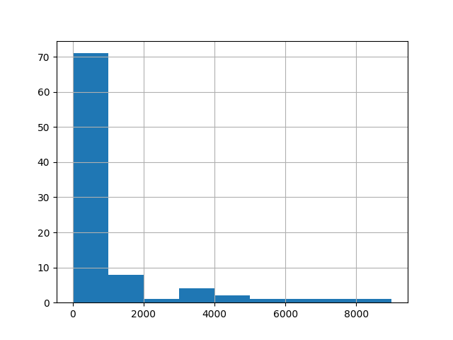
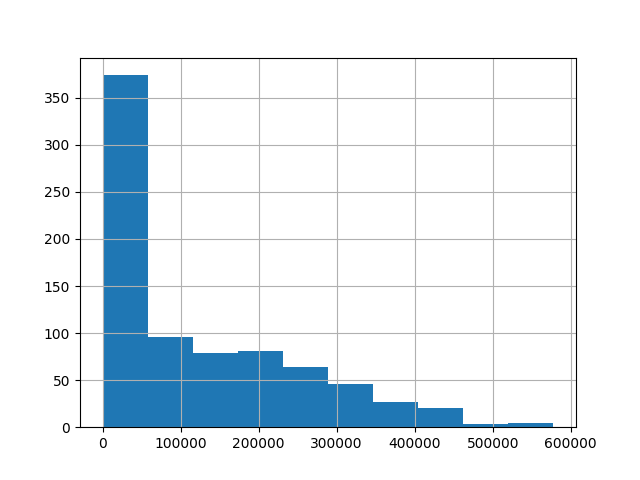

### agatston score distribution


+ obtain dataset [COCA- Coronary Calcium and chest CT’s](https://stanfordaimi.azurewebsites.net/datasets/e8ca74dc-8dd4-4340-815a-60b41f6cb2aa)

```
azcopy cp ${AZURE_URL} ${DEST_FOLDER} --recursive=true
```

+ segment coronary arteries

```
docker run -it --gpus 'device=0' --ipc=host -v /mnt:/mnt wasserth/totalsegmentator:2.0.0 bash

cd ..
docker run -it --gpus 'device=0' --ipc=host -w $PWD:/opt/app -v ${DEST_FOLDER}:/dataset
     -v /mnt:/mnt wasserth/totalsegmentator:2.0.0 bash


```

```


```


+ TODO:
verify with above dataset


+ dataset: Totalsegmentator


+ for data selection criteria: see `agg.py`.


filtered:

```
df = df[(df.median_hu<60)&(df.mask_volume>100000)] # ??
```




----


raw (makes no sense):


